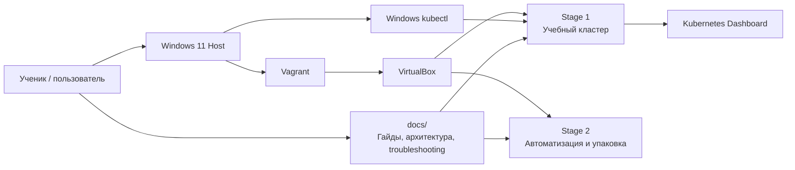
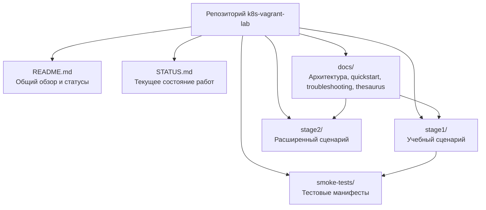
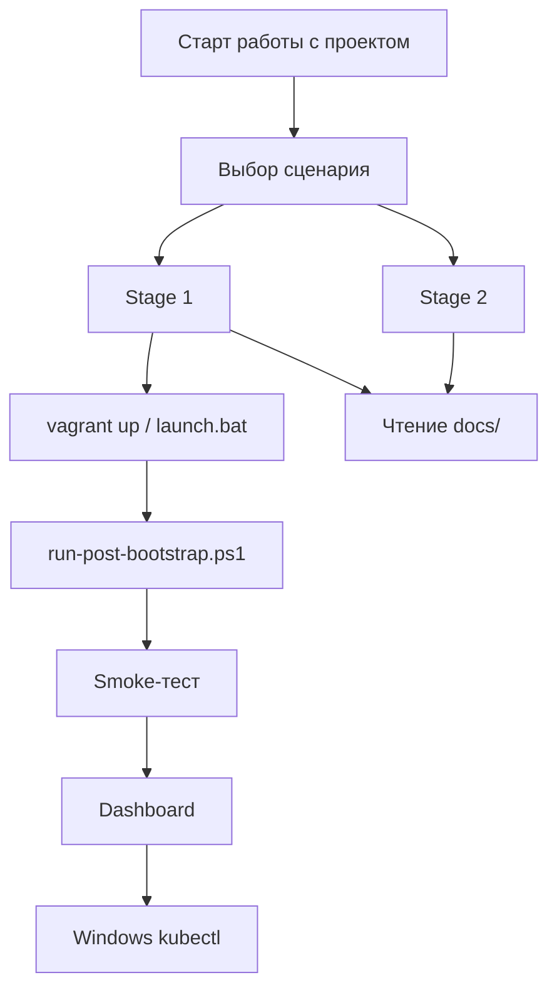
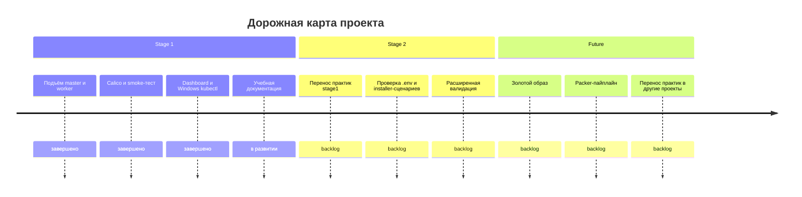

# k8s-vagrant-lab

Локальный учебный Kubernetes-стенд на Windows 11 Home + VirtualBox + Vagrant.

Проект устроен по этапам:

- `stage1` — учебный сценарий с максимально прозрачной логикой, подробными комментариями и ручной проверкой;
- `stage2` — следующий уровень автоматизации и упаковки;
- `docs/` — учебные и справочные материалы по запуску, архитектуре и диагностике.

---

## Честная пометка о происхождении и проверке

На текущем этапе значительная часть структуры, сценариев, комментариев и документации в этом репозитории была подготовлена с помощью нейросетевых ассистентов.

Это важно фиксировать прямо и без украшений:

- наличие рабочего сценария ещё не означает полноценную реальную эксплуатационную зрелость;
- локальная техническая проверка и ручной smoke-тест уже были выполнены;
- полноценное чек-ревью и верификация от независимых реальных пользователей пока не получены;
- поэтому любые учебные и инженерные выводы пока нужно считать предварительно подтверждёнными, а не окончательно доказанными практикой.

---

## Система статусов артефактов

### Зрелость

- `BACKLOG`
- `DRAFT`
- `IN_PROGRESS`
- `REVIEW`
- `VERIFIED`
- `PRACTICED`

### Происхождение

- `AI_ASSISTED`
- `HUMAN_AUTHORED`
- `HYBRID`

### Проверка

- `SELF_CHECKED`
- `PEER_REVIEWED`
- `USER_VALIDATED`
- `FIELD_PROVEN`

Минимальная честная карточка для артефакта:

```text
Maturity: VERIFIED
Origin: HYBRID
Verification: SELF_CHECKED
Real-user validation: NO
```

Для текущего `stage1` честная формулировка сейчас такая:

```text
Maturity: VERIFIED
Origin: HYBRID
Verification: SELF_CHECKED
Real-user validation: NO
```

---

## C1: Контекст проекта



Эта диаграмма показывает проект целиком:

- пользователь работает на Windows-хосте;
- Vagrant управляет VirtualBox;
- в VirtualBox поднимаются сценарии `stage1` и позже `stage2`;
- документация объясняет, как пользоваться и как проверять результат;
- `kubectl` и Dashboard дают два разных способа видеть один и тот же кластер.

---

## C2: Контейнеры внутри репозитория



---

## Flow: Учебный путь пользователя



---

## Timeline: Дорожная карта работ



---

## С чего начинать

Если цель — быстро поднять рабочий кластер, понять его шаги и проверить его из браузера и из терминала Windows, начинать нужно со `stage1`.

Именно там сейчас подтверждён рабочий сценарий:

1. `vagrant up`
2. `powershell -ExecutionPolicy Bypass -File .\scripts\run-post-bootstrap.ps1`
3. вход в Dashboard
4. проверка `smoke-tests`
5. проверка `kubectl` прямо из Windows PowerShell

---

## Самый короткий запуск Stage 1

```powershell
cd K:\repositories\git\ipr\crm\stage1
.\launch.bat
```

`launch.bat` последовательно делает:

1. `vagrant up`
2. post-bootstrap сценарий
3. настройку Calico
4. smoke-тест `nginx`
5. установку Dashboard
6. подготовку `kubeconfig` для Windows-хоста

Если хочется видеть шаги явно:

```powershell
cd K:\repositories\git\ipr\crm\stage1
vagrant up
powershell -ExecutionPolicy Bypass -File .\scripts\run-post-bootstrap.ps1
```

---

## Проверка через браузер

Открой:

`https://localhost:30443`

После входа нужно увидеть:

- 3 ноды в разделе `Nodes`;
- namespace `smoke-tests`;
- развёрнутый `nginx-smoke`;
- завершившийся `nginx-smoke-check`.

---

## Работа с `kubectl` прямо из Windows PowerShell

После успешного `run-post-bootstrap.ps1` сценарий `stage1` автоматически создаёт локальный host-side файл:

`K:\repositories\git\ipr\crm\stage1\kubeconfig-stage1.yaml`

Этот файл позволяет использовать обычный `kubectl` прямо из Windows PowerShell, без `vagrant ssh`.

### Подключение вручную

```powershell
$env:KUBECONFIG = "K:\repositories\git\ipr\crm\stage1\kubeconfig-stage1.yaml"
```

### Подключение через helper

```powershell
cd K:\repositories\git\ipr\crm\stage1
. .\scripts\use-stage1-kubectl.ps1
```

### Что можно проверить из Windows

```powershell
kubectl get nodes -o wide
kubectl get pods -A -o wide
kubectl get ns
kubectl get all -n smoke-tests -o wide
kubectl get svc -n kubernetes-dashboard
kubectl cluster-info
```

---

## Если нужно начать заново

```powershell
cd K:\repositories\git\ipr\crm\stage1
vagrant destroy -f
vagrant up
powershell -ExecutionPolicy Bypass -File .\scripts\run-post-bootstrap.ps1
```

Если `destroy` был прерван или машины удалялись вручную через VirtualBox, сначала очисти локальное состояние `stage1`:

```powershell
cd K:\repositories\git\ipr\crm\stage1
Remove-Item -Recurse -Force .\.vagrant -ErrorAction SilentlyContinue
Remove-Item -Force .\join-command.sh -ErrorAction SilentlyContinue
```

---

## Документация

- [Stage 1 README](K:\repositories\git\ipr\crm\stage1\README.md)
- [Stage 2 README](K:\repositories\git\ipr\crm\stage2\README.md)
- [Быстрый старт](K:\repositories\git\ipr\crm\docs\quickstart.md)
- [Архитектура](K:\repositories\git\ipr\crm\docs\architecture.md)
- [Устранение неисправностей](K:\repositories\git\ipr\crm\docs\troubleshooting.md)
- [Тезаурус](K:\repositories\git\ipr\crm\docs\thesaurus.md)
