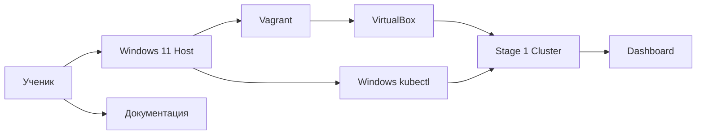
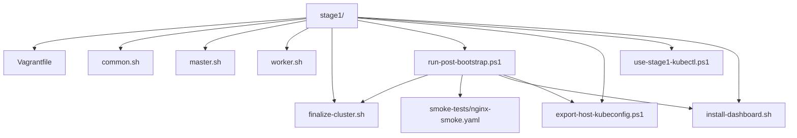
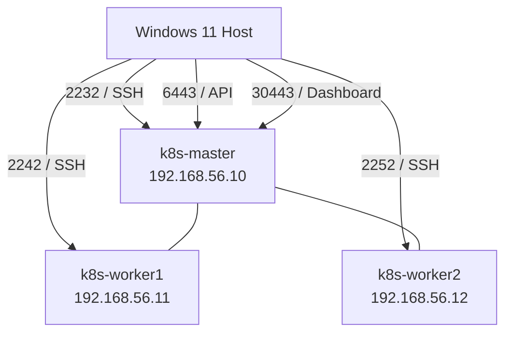
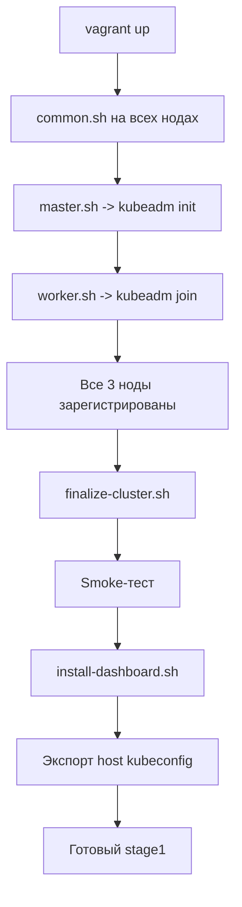
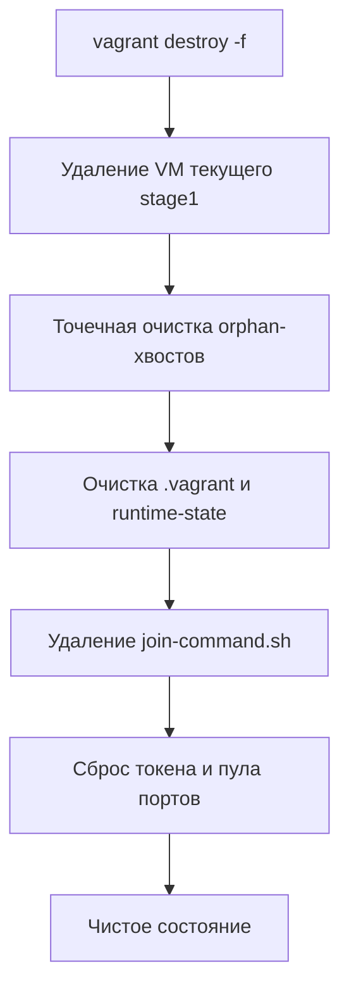
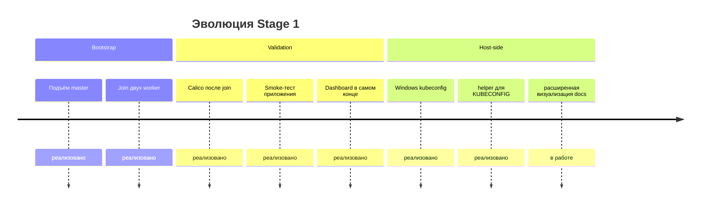

# Архитектура Stage 1

## Общая идея

`stage1` построен как учебный сценарий из двух больших фаз:

1. базовый bootstrap кластера;
2. финальная post-bootstrap проверка и настройка.

Это сделано специально:

- ученик видит, что кластер и дополнительные сервисы не одно и то же;
- можно отдельно диагностировать проблемы bootstrap и проблемы финальной настройки;
- Dashboard не мешает базовому подъёму master и worker-нод.

---

## C1: Контекст Stage 1

---

## C2: Внутренние контейнеры Stage 1

---

## Топология

---

## Flow: Подъём кластера

---

## Порядок этапов

### Этап 1. `vagrant up`

Во время `vagrant up` происходит:

1. создание трёх ВМ;
2. выполнение `common.sh` на всех нодах;
3. выполнение `master.sh` на master;
4. выполнение `worker.sh` на worker-нодах.

Результат этапа:

- master уже инициализирован;
- worker-ноды уже присоединились;
- кластер существует как Kubernetes-кластер.

### Этап 2. `run-post-bootstrap.ps1`

Потом выполняется host-side сценарий:

1. проверка регистрации нод;
2. запуск `finalize-cluster.sh`;
3. проверка и ожидание Calico;
4. применение smoke-манифеста;
5. ожидание успешного smoke-теста;
6. запуск `install-dashboard.sh`;
7. экспорт host-side `kubeconfig` для Windows.

Результат этапа:

- кластер не просто поднят, а подтверждён как рабочий;
- Dashboard поднимается как финальное удобство;
- из Windows можно работать обычным `kubectl`.

---

## Роли основных скриптов

### `stage1/Vagrantfile`

Отвечает за:

- описание трёх машин;
- сеть и порты;
- уникальный VirtualBox-префикс;
- post-destroy очистку хвостов;
- запуск provisioning-скриптов в правильном порядке.

### `stage1/scripts/common.sh`

Отвечает за общую подготовку всех нод:

- swap;
- модули ядра;
- `sysctl`;
- `containerd`;
- `kubeadm`, `kubelet`, `kubectl`;
- `--node-ip`.

### `stage1/scripts/master.sh`

Отвечает за базовый bootstrap master:

- `kubeadm init`;
- подготовку kubeconfig;
- создание `join-command.sh`.

### `stage1/scripts/worker.sh`

Отвечает за присоединение worker-ноды:

- ожидание `join-command.sh`;
- выполнение `kubeadm join`.

### `stage1/scripts/finalize-cluster.sh`

Отвечает за post-bootstrap сетевую финализацию:

- ожидание всех нод;
- проверку и применение Calico;
- ожидание `Ready`-состояния нод;
- ожидание Pod-ов Calico.

### `stage1/scripts/install-dashboard.sh`

Отвечает только за Dashboard:

- установку Helm при необходимости;
- установку Dashboard chart;
- перевод сервиса в `NodePort`;
- создание `admin-user`;
- вывод токена и URL.

### `stage1/scripts/export-host-kubeconfig.ps1`

Этот скрипт:

- забирает `admin.conf` с master-ноды;
- сохраняет host-side копию в `stage1\kubeconfig-stage1.yaml`;
- подготавливает её для доступа к API через `127.0.0.1:6443`.

### `stage1/scripts/use-stage1-kubectl.ps1`

Этот helper:

- устанавливает `KUBECONFIG` в текущей PowerShell-сессии;
- позволяет сразу использовать обычный Windows `kubectl`;
- помогает ученику понять, как работает переменная окружения `KUBECONFIG`.

---

## Flow: Логика `destroy`

---

## Timeline: Эволюция сценария

---

## Почему используется smoke-тест

Один только `kubectl get nodes` ещё не доказывает, что кластер реально пригоден для работы.

Поэтому в корне проекта есть:

`smoke-tests/nginx-smoke.yaml`

Он проверяет сразу несколько уровней:

- scheduler может разместить Pod-ы;
- Service работает;
- DNS внутри кластера работает;
- Pod-сеть между нодами работает;
- приложение реально отвечает на HTTP-запрос.

---

## Почему Dashboard идёт после smoke-теста

Правильный учебный приоритет такой:

1. поднять ноды;
2. собрать кластер;
3. проверить сеть;
4. проверить простое приложение;
5. только потом ставить веб-интерфейс.

---

## Windows-side доступ после post-bootstrap

Архитектурно `stage1` теперь заканчивается не только установкой Dashboard, но и подготовкой host-side доступа из Windows PowerShell.

Что происходит:

1. `run-post-bootstrap.ps1` запускает `export-host-kubeconfig.ps1`;
2. host-side копия сохраняется как `stage1\kubeconfig-stage1.yaml`;
3. адрес API приводится к `https://127.0.0.1:6443`, потому что именно этот порт проброшен на Windows-хост;
4. ученик после этого может проверять кластер обычным `kubectl` уже из Windows.
