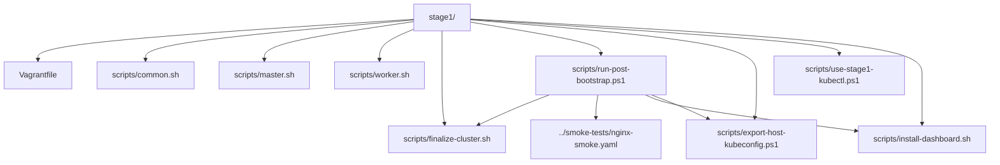
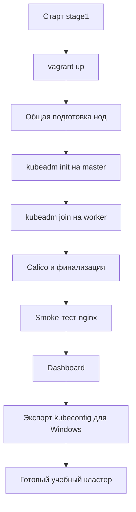
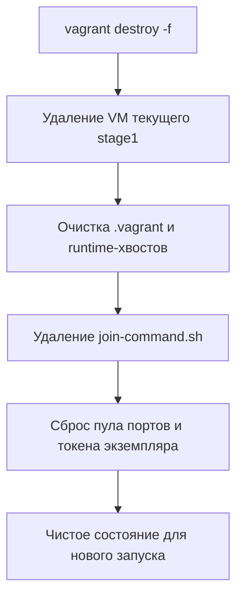

# Kubernetes Cluster - Stage 1

> Это учебный сценарий.
> Здесь всё намеренно максимально прозрачно: фиксированные имена нод, фиксированные IP, подробные комментарии и пошаговый сценарий.
> Цель `stage1` - не спрятать сложность, а показать ученику, из каких шагов реально собирается рабочий Kubernetes-кластер.

---

## C2: Внутренняя структура Stage 1



---

## Flow: Как собирается Stage 1



---

## Что получится в конце

После запуска у тебя будет локальный кластер из трёх виртуальных машин:

- `k8s-master` - управляющая нода;
- `k8s-worker1` - рабочая нода;
- `k8s-worker2` - рабочая нода.

После финальной настройки ты увидишь:

- 3 ноды в состоянии `Ready`;
- Pod-сеть Calico;
- namespace `smoke-tests`;
- приложение `nginx-smoke`;
- Kubernetes Dashboard;
- рабочий `kubectl` прямо из Windows PowerShell.

---

## Самый короткий ручной запуск

```powershell
vagrant up
powershell -ExecutionPolicy Bypass -File .\scripts\run-post-bootstrap.ps1
```

Или просто:

```powershell
.\launch.bat
```

После этого:

1. открой `https://localhost:30443`;
2. подтверди переход на страницу с самоподписанным сертификатом;
3. вставь токен, который вывел `run-post-bootstrap.ps1`;
4. в Dashboard проверь:
   - раздел `Nodes`;
   - namespace `smoke-tests`;
   - `nginx-smoke`;
   - `nginx-smoke-check`.

---

## Что делает каждая команда

### `vagrant up`

Эта команда:

1. создаёт 3 виртуальные машины в VirtualBox;
2. подготавливает на них Linux, containerd, `kubeadm`, `kubelet` и `kubectl`;
3. выполняет `kubeadm init` на master;
4. присоединяет worker-ноды через `kubeadm join`.

Это базовый bootstrap кластера.

### `run-post-bootstrap.ps1`

Эта команда завершает сценарий в правильном учебном порядке:

1. проверяет, что все 3 ноды зарегистрировались;
2. доводит сетевую часть и Calico;
3. применяет smoke-тест из корня проекта;
4. ждёт успешного завершения проверки;
5. только потом устанавливает Dashboard;
6. экспортирует host-side `kubeconfig` для Windows.

---

## Работа с `kubectl` прямо из Windows PowerShell

После `run-post-bootstrap.ps1` `stage1` автоматически подготавливает host-side `kubeconfig`:

`K:\repositories\git\ipr\crm\stage1\kubeconfig-stage1.yaml`

### Вручную установить переменную

```powershell
$env:KUBECONFIG = "K:\repositories\git\ipr\crm\stage1\kubeconfig-stage1.yaml"
```

### Или использовать helper-скрипт

```powershell
. .\scripts\use-stage1-kubectl.ps1
```

---

## Команды проверки кластера из Windows

```powershell
kubectl get nodes -o wide
kubectl get pods -A -o wide
kubectl get ns
kubectl get svc -n kubernetes-dashboard
kubectl cluster-info
```

## Команды проверки smoke-проекта

```powershell
kubectl get all -n smoke-tests -o wide
kubectl get deployment nginx-smoke -n smoke-tests
kubectl get pods -n smoke-tests -o wide
kubectl get svc -n smoke-tests
kubectl get job nginx-smoke-check -n smoke-tests
kubectl logs job/nginx-smoke-check -n smoke-tests
kubectl describe deployment nginx-smoke -n smoke-tests
kubectl describe svc nginx-smoke -n smoke-tests
kubectl get endpoints nginx-smoke -n smoke-tests
```

---

## Flow: Логика `destroy`



---

## Где смотреть в браузере

Dashboard доступен по адресу:

`https://localhost:30443`

Если токен потерялся, его можно получить заново:

```powershell
vagrant ssh k8s-master -c "sudo KUBECONFIG=/etc/kubernetes/admin.conf kubectl -n kubernetes-dashboard create token admin-user --duration=24h"
```

---

## Что читать дальше

- [README](K:\repositories\git\ipr\crm\README.md)
- [Быстрый старт](K:\repositories\git\ipr\crm\docs\quickstart.md)
- [Архитектура](K:\repositories\git\ipr\crm\docs\architecture.md)
- [Устранение неисправностей](K:\repositories\git\ipr\crm\docs\troubleshooting.md)
- [Тезаурус](K:\repositories\git\ipr\crm\docs\thesaurus.md)
