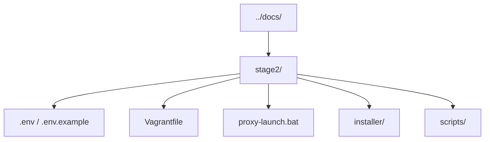
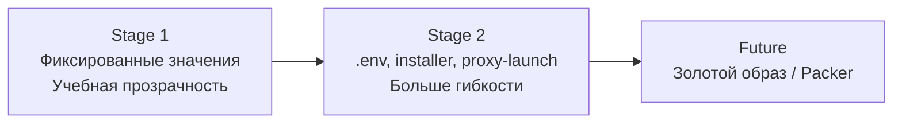
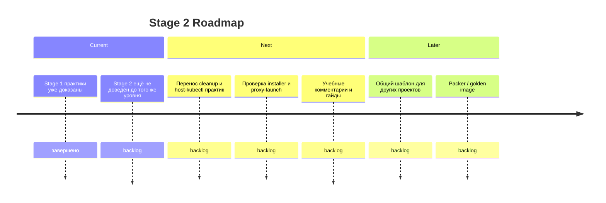

# Kubernetes Cluster Lab - Stage 2

> Это `stage2`.
> Здесь живёт более гибкий и упаковочный сценарий: `.env`, SSH-ключи, proxy-launch, installer и более настраиваемая конфигурация кластера.
>
> Если ты только начинаешь, сначала пройди `../stage1/`.

---

## C2: Контейнеры Stage 2



---

## Flow: Stage 2 по сравнению со Stage 1



---

## Что добавляет Stage 2 по сравнению со Stage 1

| Возможность | Stage 1 | Stage 2 |
|---|---|---|
| Конфигурация | Хардкод в Vagrantfile | Переменные в `.env` |
| SSH | `vagrant` по стандартной логике | Отдельные ключи и host-side automation |
| Запуск | `vagrant up` или `launch.bat` | `proxy-launch.bat` и installer |
| Число worker-ов | Фиксировано | Параметризуется |
| CPU/RAM | Фиксировано | Настраивается |
| Подсеть | Фиксирована | Параметризуется |

---

## Timeline: Дорожная карта Stage 2



---

## Быстрый старт

### Вариант A: proxy-launch

```powershell
cd K:\repositories\git\ipr\crm\stage2
.\proxy-launch.bat
```

### Вариант B: вручную

```powershell
cd K:\repositories\git\ipr\crm\stage2
copy .env.example .env
vagrant up
```

---

## Что важно помнить сейчас

На текущем этапе проекта основной технически подтверждённый и учебно завершённый сценарий — это `stage1`.

`stage2` пока нужно рассматривать как следующий слой развития:

- более гибкий;
- более ближе к реальной автоматизации;
- но ещё не с тем же уровнем подтверждения и учебной доводки, что уже есть в `stage1`.

---

## Что читать дальше

- [README](K:\repositories\git\ipr\crm\README.md)
- [Stage 1 README](K:\repositories\git\ipr\crm\stage1\README.md)
- [Архитектура](K:\repositories\git\ipr\crm\docs\architecture.md)
- [Быстрый старт](K:\repositories\git\ipr\crm\docs\quickstart.md)
