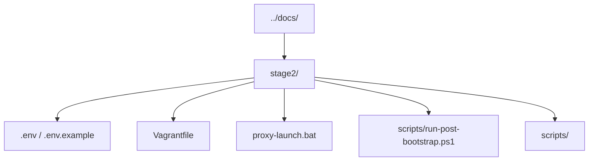
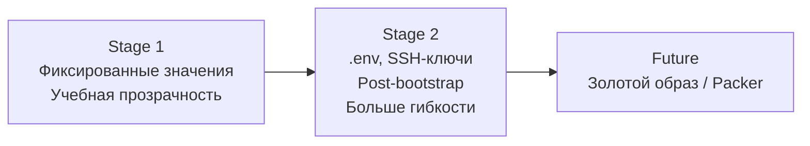
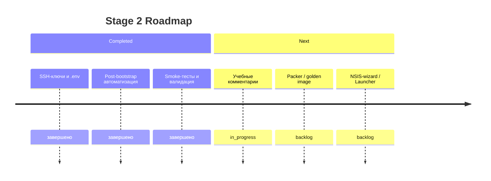

# Kubernetes Cluster Lab - Stage 2

> Это `stage2` — гибкий сценарий с настраиваемой конфигурацией, SSH-ключами и post-bootstrap автоматизацией.
>
> Если ты только начинаешь, сначала пройди `../stage1/`.

---

## C2: Контейнеры Stage 2



---

## Flow: Stage 2 по сравнению со Stage 1



---

## Что добавляет Stage 2 по сравнению со Stage 1

| Возможность | Stage 1 | Stage 2 |
|-------------|---------|---------|
| Конфигурация | Хардкод в Vagrantfile | Переменные в `.env` |
| SSH | `vagrant/vagrant` (пароль) | SSH-ключи (`.vagrant/node-keys/*.ed25519`) |
| Запуск | `vagrant up` или `launch.bat` | `proxy-launch.bat` с параметрами |
| Число worker-ов | Фиксировано (2) | Настраивается (`WORKER_COUNT`) |
| CPU/RAM | Фиксировано | Настраивается (`VM_CPUS`, `VM_MEMORY_MB`) |
| Подсеть | Фиксирована | Параметризуется (`PRIVATE_NETWORK_PREFIX`) |
| Post-bootstrap | Ручной запуск | Автоматический после `vagrant up` |
| Kubeconfig для Windows | Ручной экспорт | Автоматический экспорт |

---

## Быстрый старт

### Вариант A: proxy-launch (рекомендуется)

```powershell
cd K:\repositories\git\ipr\crm\stage2
.\proxy-launch.bat
```

С параметрами:

```powershell
.\proxy-launch.bat --workers=3 --cpus=4 --memory=4096
```

### Вариант B: вручную

```powershell
cd K:\repositories\git\ipr\crm\stage2
copy .env.example .env
vagrant up
```

---

## Что происходит после `vagrant up`

`proxy-launch.bat` автоматически запускает `run-post-bootstrap.ps1`, который:

1. **Проверяет регистрацию всех нод** — ждёт, когда все worker-ноды присоединятся
2. **Финализирует сеть** — проверяет готовность Calico CNI
3. **Запускает smoke-тест** — разворачивает `nginx-smoke` deployment + Job
4. **Ждёт успеха smoke-теста** — проверяет, что Job завершился успешно
5. **Устанавливает Dashboard** — только после подтверждения работоспособности кластера
6. **Экспортирует kubeconfig** — создаёт `kubeconfig-stage2.yaml` для Windows-хоста

---

## Работа с `kubectl` прямо из Windows PowerShell

После `run-post-bootstrap.ps1` автоматически создаётся:

`K:\repositories\git\ipr\crm\stage2\kubeconfig-stage2.yaml`

### Вручную установить переменную

```powershell
$env:KUBECONFIG = "K:\repositories\git\ipr\crm\stage2\kubeconfig-stage2.yaml"
```

### Или использовать helper-скрипт

```powershell
. .\scripts\use-stage2-kubectl.ps1
```

---

## Команды проверки кластера из Windows

```powershell
kubectl get nodes -o wide
kubectl get pods -A -o wide
kubectl get ns
kubectl get svc -n kubernetes-dashboard
kubectl cluster-info
```

## Команды проверки smoke-проекта

```powershell
kubectl get all -n smoke-tests -o wide
kubectl get deployment nginx-smoke -n smoke-tests
kubectl get pods -n smoke-tests -o wide
kubectl get job nginx-smoke-check -n smoke-tests
kubectl logs job/nginx-smoke-check -n smoke-tests
```

---

## Конфигурация через .env

| Переменная | Описание | По умолчанию |
|------------|----------|--------------|
| `CLUSTER_PREFIX` | Префикс имён ВМ | `lab-k8s` |
| `WORKER_COUNT` | Количество worker-нод | `2` |
| `VM_CPUS` | CPU на каждую ноду | `4` |
| `VM_MEMORY_MB` | RAM на каждую ноду (MB) | `8192` |
| `PRIVATE_NETWORK_PREFIX` | Подсеть host-only | `192.168.56` |
| `MASTER_PRIVATE_IP` | IP master-ноды | `192.168.56.10` |
| `MASTER_SSH_PORT` | Порт SSH master (host) | `2232` |
| `MASTER_API_PORT` | Порт Kubernetes API | `6443` |
| `MASTER_DASHBOARD_PORT` | Порт Dashboard | `30443` |
| `KUBERNETES_VERSION` | Версия Kubernetes | `1.34` |
| `POD_CIDR` | Pod-сеть (Calico) | `10.244.0.0/16` |

---

## Где смотреть Dashboard

Dashboard доступен по адресу:

`https://localhost:30443`

Токен можно получить:

```powershell
vagrant ssh lab-k8s-master -- kubectl -n kubernetes-dashboard create token admin-user
```

Или через PowerShell:

```powershell
vagrant ssh lab-k8s-master -c "sudo KUBECONFIG=/etc/kubernetes/admin.conf kubectl -n kubernetes-dashboard create token admin-user"
```

---

## Остановка и удаление кластера

```powershell
# Остановить (сохранить состояние)
.\proxy-launch.bat --halt

# Удалить полностью
.\proxy-launch.bat --destroy

# Статус ВМ
.\proxy-launch.bat --status
```

---

## Timeline: Дорожная карта Stage 2



---

## Что читать дальше

- [README](../README.md)
- [Stage 1 README](../stage1/README.md)
- [Архитектура](../docs/architecture.md)
- [Быстрый старт](../docs/quickstart.md)
- [Устранение неисправностей](../docs/troubleshooting.md)
